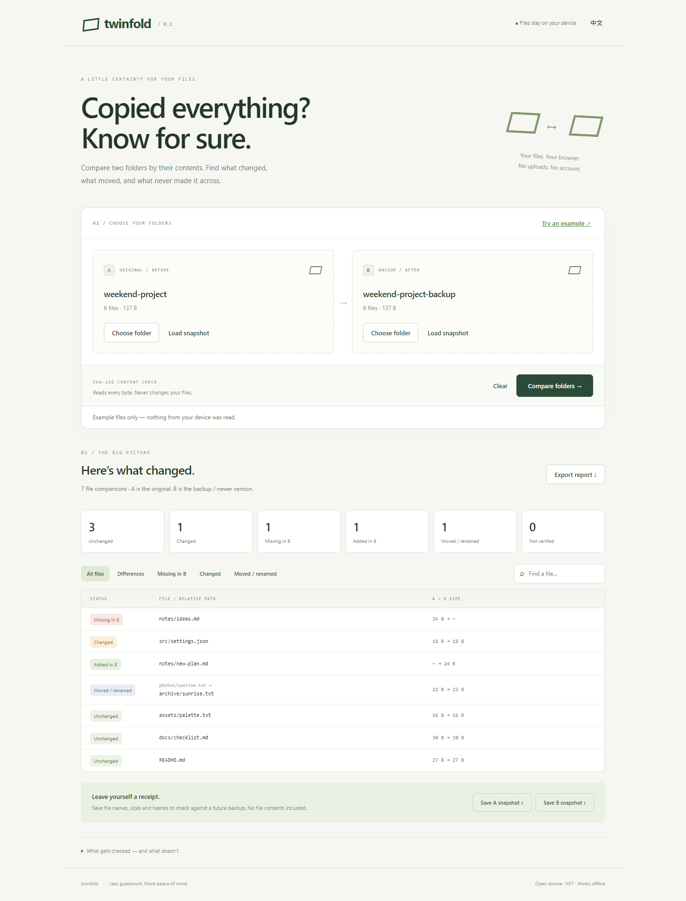

<div align="center">

# Twinfold

### Did your backup actually work?

Compare two folders by content. Find missing files, changes, and moves.<br>
**One small HTML file. No uploads. No account. Works offline.**

[Open the app](https://sq2100.com/twinfold/) · [Download offline HTML](https://github.com/sq2100/twinfold/releases/latest) · [简体中文](README.zh-CN.md) · [How it works](#how-it-works)

</div>



You copied a project to a USB drive. You reorganized your photos. You downloaded a backup. The file count looks right — but is everything actually there?

Twinfold checks file contents using SHA-256 and gives you a clear answer for every readable file.

## Try it

Open the [online demo](https://sq2100.com/twinfold/) and click **Try an example**, or download the standalone HTML from [Releases](https://github.com/sq2100/twinfold/releases/latest).

Requires Node.js 20.19+ to **build**. The finished app only needs a desktop browser.

```sh
npm ci
npm run build
```

Open **`dist/index.html`** directly in your browser. Click **Try an example** to explore the result without selecting any personal files.

Or run `npm start` and open <http://127.0.0.1:4178>.

You can copy the built HTML to a USB drive, email it, or host it on any static web server. JavaScript, styles, hashing code, and license notices are bundled into the file. There are no CDN scripts, API keys, tracking pixels, or runtime package downloads.

## What you get

- **Content verification:** catches changed contents even if file names and sizes match.
- **Missing and added files:** paths are relative to the two selected roots.
- **Moves and renames:** recognizes unique identical-content pairs at different paths.
- **Reusable snapshots:** save names, sizes and hashes now; compare with a future backup later.
- **CSV reports:** export all results, including the two content hashes.
- **Readable results:** status filters, path search, and English / Chinese UI.
- **Bounded file buffering:** sequential hashing reads 4 MiB at a time instead of loading whole videos into memory.
- **Read-only:** never moves, modifies, synchronizes, or deletes source files.

## Three useful workflows

**Check a copy:** Select the source as A and the copied folder as B. Compare. Investigate files marked missing, changed, or not verified.

**Check after reorganizing:** Select the old and new folders. Unique content matches at different paths appear as moved / renamed, instead of a misleading missing-plus-added pair.

**Check against a past version:** Compare two folders, then save a snapshot of A or B. Later, load that JSON on one side and select your current folder on the other. Snapshots contain no file contents, but they do contain file names and hashes.

## How it works

1. The browser enumerates the selected files. Root folder names are removed from the comparison paths.
2. The bundled [`@noble/hashes`](https://github.com/paulmillr/noble-hashes) implementation hashes local files incrementally with SHA-256.
3. Same relative paths are matched first. Matching size and hash means unchanged contents.
4. Remaining files are grouped by size and hash. Only one-to-one pairs are called moves. Ambiguous duplicate-content matches remain missing / added.
5. Unreadable files are explicitly marked **Not verified**. Incomplete snapshots cannot be exported.

All file names are rendered as text. CSV exports neutralize common spreadsheet formula prefixes. A restrictive Content Security Policy blocks network connections and external scripts. No file data or settings are written to local storage, IndexedDB, or cookies. Reloading the page clears the app state; exported files remain wherever you save them.

If you use a hosted copy, the host receives ordinary page-request metadata such as your IP address. For a fully disconnected workflow, use the downloaded HTML offline. Browser extensions and the operating system are outside this app's control.

## Limitations

- Compares **file contents and case-sensitive relative paths**, not empty directories, permissions, ownership, timestamps, symbolic-link identity, or filesystem metadata.
- Covers only files the browser enumerates and can read. Hidden/system entries and cloud placeholders depend on browser and operating-system behavior.
- Keep both folders unchanged during a scan. This is not an atomic filesystem snapshot.
- A snapshot is an unsigned record, not proof of provenance, timestamp, or backup location. Loading one trusts its recorded hashes; it cannot establish that the recorded files still exist elsewhere.
- Identical contents do not establish a file's history. “Moved” means a unique content match at a different path.
- File data is processed in bounded chunks, but file lists, hashes, and result rows still use memory proportional to file count. This version has not been benchmarked on multi-terabyte archives or millions of files.
- Imported snapshots are limited to 40 MiB / 100,000 records. Paths containing backslashes, colons, null bytes or traversal segments are rejected.
- Desktop Chromium was tested locally. Other modern desktop browsers may work; directory selection and drag-and-drop support vary. Mobile is useful for viewing the UI and demo, but desktop is recommended for folder checks.
- This is a comparison tool, not a backup or synchronization service.

## Development

```sh
npm ci
npm test
npm run build
npm start
```

No framework or application server is required. `src/core.js` contains the comparison and snapshot rules, `src/app.js` the browser interaction, and `scripts/build.mjs` generates the portable HTML with hash-based CSP directives.

Tests cover same-size edits, move ambiguity, unreadable files, unsafe snapshots, chunk-boundary hashing, cancellation, Unicode paths, and CSV formula escaping. The GitHub workflow runs these tests and builds the offline artifact.

## Related projects

Folder comparison is an established problem. [File Integrity Checker](https://github.com/tongyi24/file-integrity-checker) also provides browser-based folder and checksum verification. [WinMerge](https://github.com/WinMerge/winmerge) and [FreeFileSync](https://freefilesync.org/) offer much broader desktop comparison or synchronization workflows.

Twinfold focuses on a small, read-only backup check: an approachable interface, portable offline HTML, conservative move detection, and reusable snapshots. It does not claim to invent folder comparison or replace full backup software.

## License

[MIT](LICENSE). Bundled dependency notices are in [THIRD_PARTY_NOTICES.md](THIRD_PARTY_NOTICES.md) and in the built HTML.
